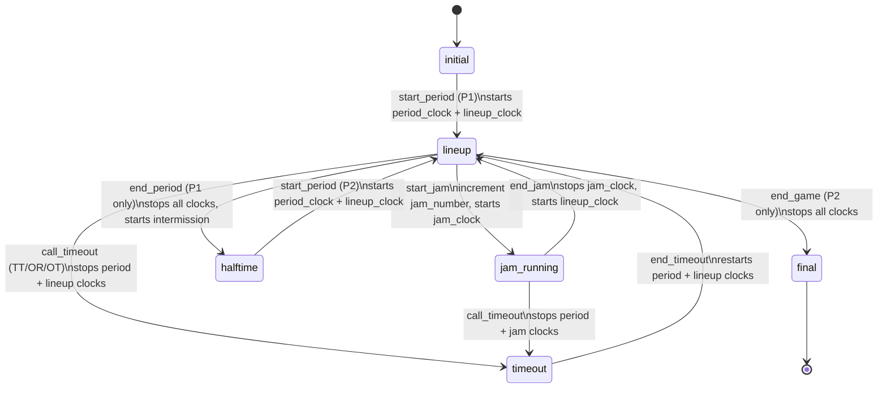
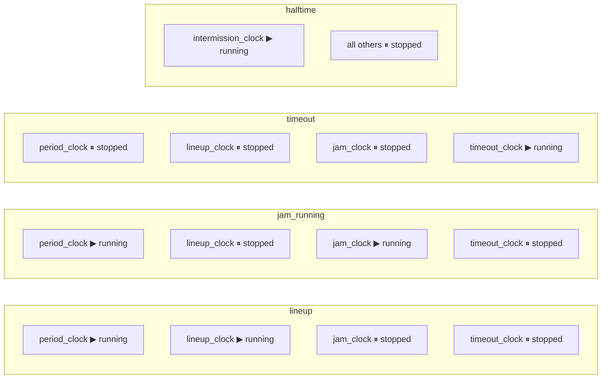

# DerbyNova Scoreboard — Game State Machine

## Phase Transitions



## Timer States per Phase



## WFTDA Timing Constants

| Timer | Duration | Notes |
|-------|----------|-------|
| Period | 30 min (1,800,000 ms) | 2 periods per game |
| Jam | 2 min (120,000 ms) | max duration |
| Lineup | 30 sec (30,000 ms) | between jams |
| Timeout | 60 sec (60,000 ms) | TT/OR |
| Intermission | 10 min (600,000 ms) | between periods |

## Snapshot Structure (current)

```elixir
%{
  phase: :initial | :lineup | :jam_running | :timeout | :halftime | :final,
  period: 0 | 1 | 2,
  jam_number: integer,
  score_home: integer,
  score_away: integer,
  period_clock_s: integer,      # remaining seconds
  lineup_clock_s: integer,
  jam_clock_s: integer,
  timeout_clock_s: integer,
  period_clock_running: boolean,
  lineup_clock_running: boolean,
  jam_clock_running: boolean,
  timeout_clock_running: boolean
}
```

Snapshot is extended in M2 with: rosters, penalties, jam details, timeout types.
Snapshot is extended in M4 with: override flags, custom timer values.
