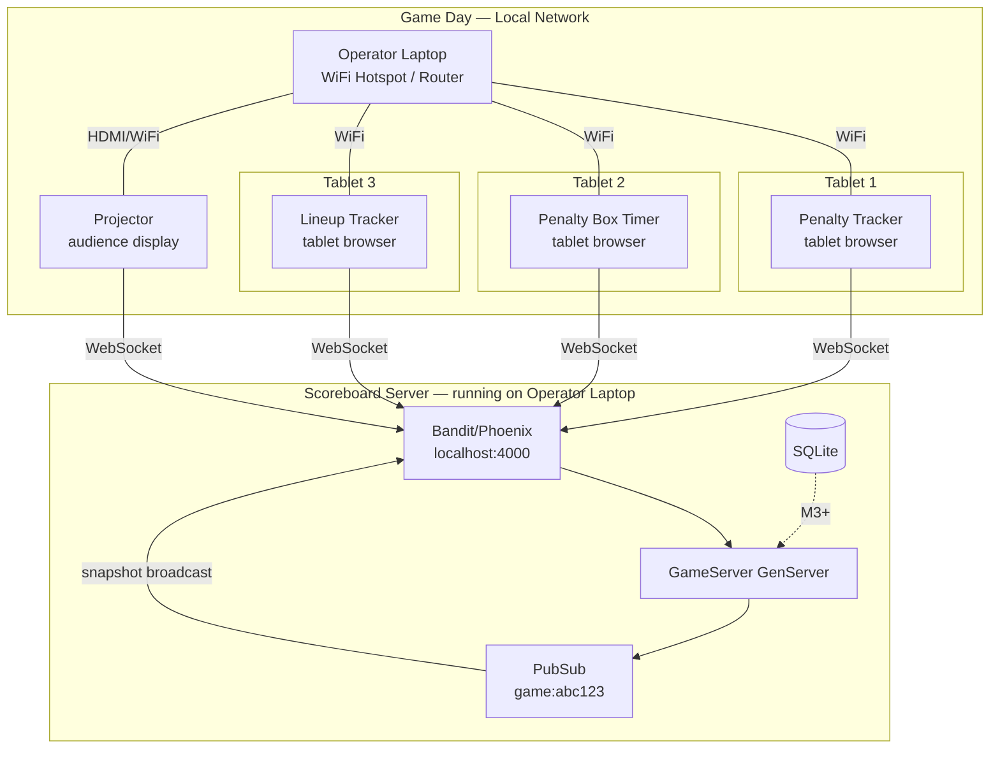
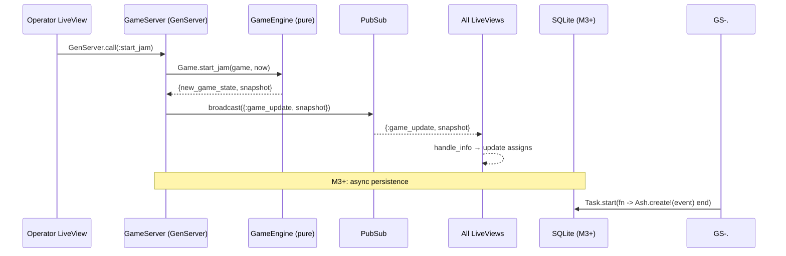

# DerbyNova Scoreboard — Multi-Operator Data Flow

## Operator Roles & LiveViews

## Request/Response Flow

## URL Scheme

| Route | LiveView | Role | Device |
|-------|----------|------|--------|
| `/` | Index | Landing page — create/join game | Laptop |
| `/games/:id/operator` | Operator | Score + phase control | Laptop |
| `/games/:id/scoreboard` | Audience | Public display | Projector |
| `/games/:id/penalty-tracker` | PenaltyTracker | Penalty encoding | Tablet |
| `/games/:id/penalty-box` | PenaltyBoxTimer | Box countdown + release | Tablet |
| `/games/:id/lineup-tracker` | LineupTracker | Lineup + jammer calls | Tablet |

## Connection Resilience

- All LiveViews reconnect automatically on WiFi drop (Phoenix LiveView built-in)
- On reconnect, `mount/3` fetches current snapshot from GameServer
- If GameServer crashes (M3+): state is recovered from SQLite events, PubSub reconnects
- If server process dies: audience display freezes on last snapshot (no white screen)
